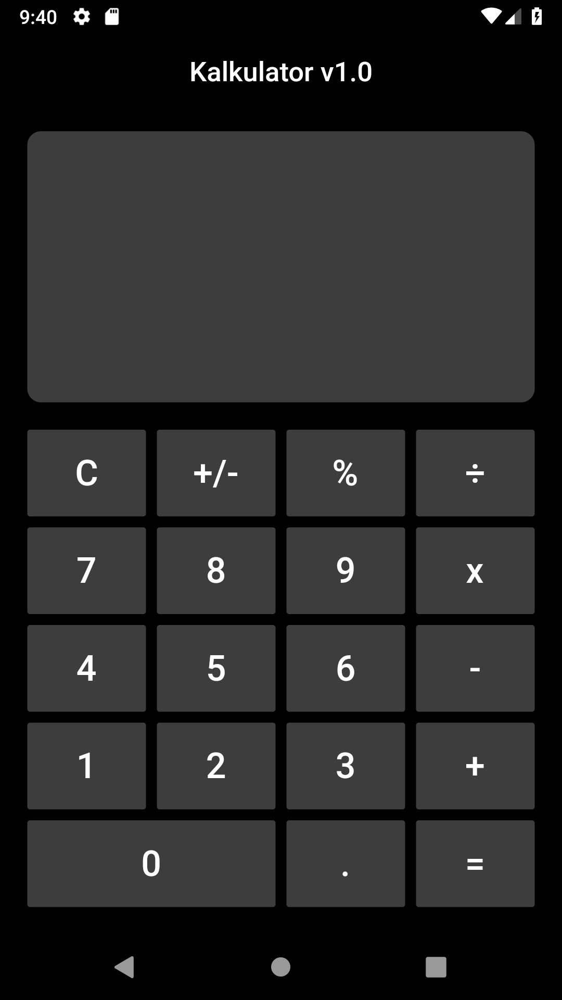

# Kalkulator

Kalkulator UI with Flutter

## :camera: Output

## :hammer: Modification

- Remove **new** keyword, according to guide of dart 2
- Add custom button widget
- Add display item for result

## :construction: Tools

- Flutter SDK
- Android SDK
- Visual Studio Code

## :sparkles: Reference

- [codewithakshay](https://www.codewithakshay.com/post/build-calculator-app-ui-using-basic-flutter-widgets) - build calculator app ui
- [RaisedButton](https://docs.flutter.io/flutter/material/RaisedButton-class.html) - RaisedButton on flutter docs
- [yuvrajpandey24](https://medium.com/@yuvrajpandey24/working-with-raised-button-in-flutter-6f5c0f71aab3) - RaisedButton on medium
