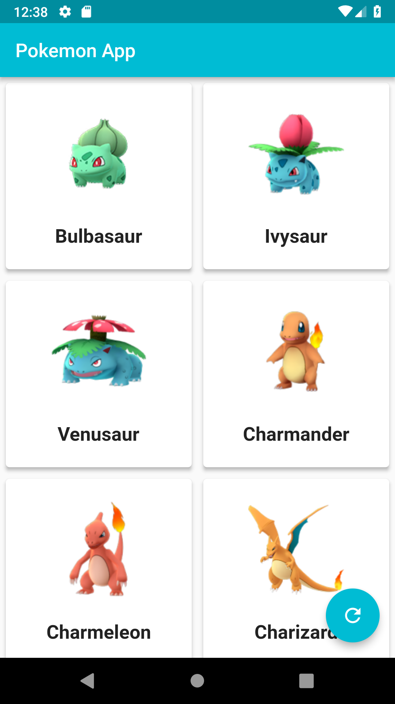
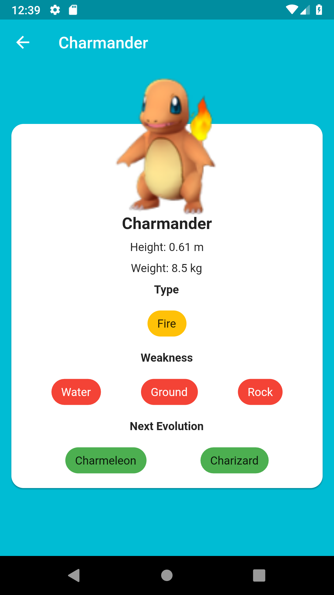

# Pokemon App

Pokemon App with Flutter

## :camera: Output

 

## :hammer: Modification

- Add prevent null data on detail page
- Add library to pubspec.yaml

  ```text
  http: ^0.12.0+2
  ```

## :construction: Tools

- Flutter SDK
- Android SDK
- Visual Studio Code

## Resource

- [PokemonGo Pokedex](https://github.com/Biuni/PokemonGO-Pokedex/blob/master/pokedex.json)

## :sparkles: Reference

- [Olusegun Festus Babajide](https://github.com/JideGuru/Pokemon-App)
- [Youtube Tutorial](https://www.youtube.com/watch?v=yeXJqZCiwTQ)
