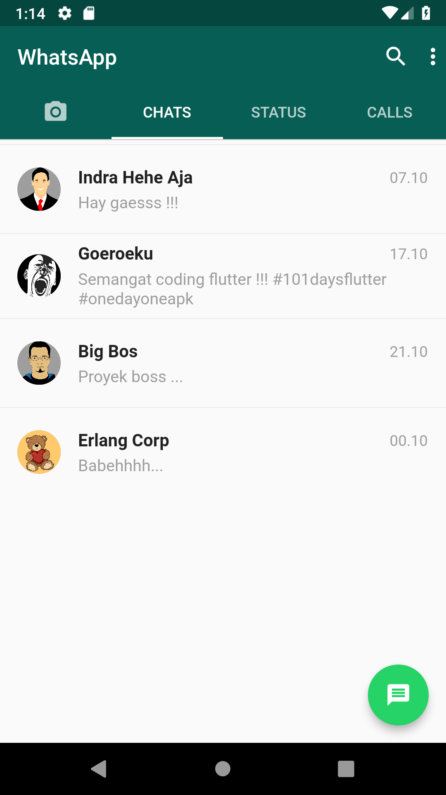
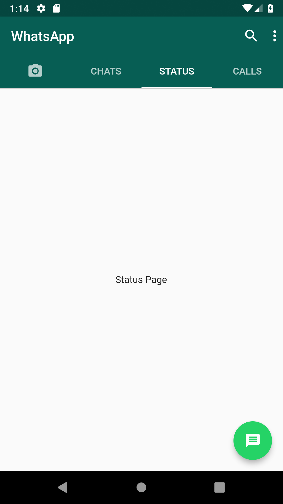

# WhatsApp Clone

WhatsApp Clone with Flutter

## :camera: Output

 

## :hammer: Modification

- Remove **new** keyword, according to guide of dart 2

## :construction: Tools

- Flutter SDK
- Android SDK
- Visual Studio Code

## :herb: Resource

- [Pixabay](https://pixabay.com)

## :sparkles: Reference

- [Youtube Tutorial](https://www.youtube.com/watch?v=2Tyrofn6zPg)
